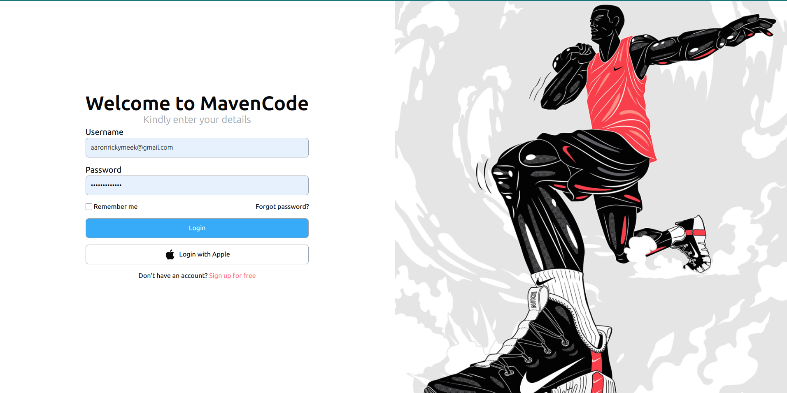
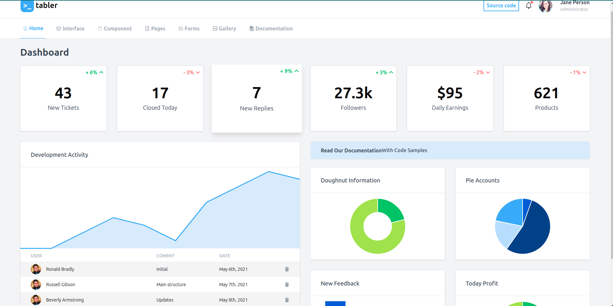
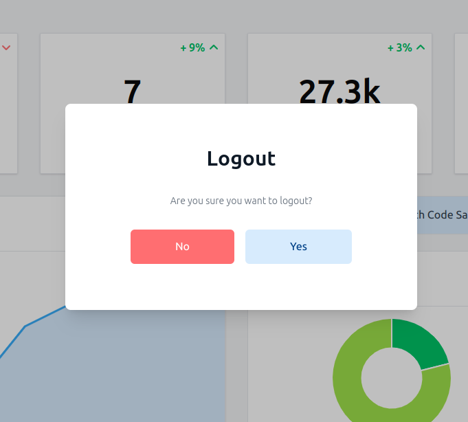

# Mavencodebd

Mavencodebd is an app templete built with React, Vite, TypeScript, and Tailwind CSS.

#### figma designs[login]: https://www.figma.com/design/xHP6FKrJs932pnYWCDiXyN/Login-Page-(Community)?node-id=2-6&node-type=frame&t=mkA4gmTpr05BkBfO-0

## Table of Contents

- [Mavencodebd](#mavencodebd) - [figma designs\[login\]: https://www.figma.com/design/xHP6FKrJs932pnYWCDiXyN/Login-Page-(Community)?node-id=2-6\&node-type=frame\&t=mkA4gmTpr05BkBfO-0](#figma-designslogin-httpswwwfigmacomdesignxhp6fkrjs932pnywcdixynlogin-page-communitynode-id2-6node-typeframetmka4gmtpr05bkbfo-0)
  - [Table of Contents](#table-of-contents)
  - [Features](#features)
  - [Installation](#installation)
  - [Usage](#usage)
  - [Scripts](#scripts)
  - [Dependencies](#dependencies)
- [Thank you for showing up here](#thank-you-for-showing-up-here)

## Features

- ⚡️ **React**: A popular JavaScript library for building user interfaces.
- 🚀 **Vite**: A fast, modern build tool and development server.
- 🦾 **TypeScript**: A strongly typed superset of JavaScript for improved code quality.
- 🎨 **Tailwind CSS**: A utility-first CSS framework for fast custom styling.
- 💄 **ESLint & Prettier**: Tools for consistent code style and formatting.
- 🚨 **React Hook Form**: Provides easy form management with built-in validation.
- 🌐 **Recoil**: A state management library designed for React applications.
- 📈 **CoreUI**: Ready-to-use components for building admin dashboards.
- ✨ **Framer Motion**: Animation library for a smooth user experience.
- 🧪 **Testing**: Includes Jest and Testing Library for reliable component testing.

## Installation

To get started with the project, clone the repository and install the dependencies:

```bash
git clone https://github.com/asapconet/mavencodedb.git
cd mavencodedb
yarn install
```

## Usage

```bash
yarn dev
```

1. Login in your approperiate details on the login page
   **NB** information could be anything as it doesn't save to any data base on backend/cloud platform, just ensure it is within the right format



2. After successful login, should you want to logout. Click the avatar on the top right conner of the dashboard  
   

3. Logout a modal will show and you can successfully logout by accepting with yes.
   

**NB** Login out will erase your login information will require you adding it afresh before login in again

## Scripts

Here are the available scripts you can run:

- **`dev`**: Start the development server.
- **`build`**: Build the application for production.
- **`lint`**: Lint the project using ESLint.
- **`preview`**: Preview the production build.
- **`test`:** Runs Jest for unit tests.
- **`test:watch`:** Runs Jest in watch mode for continuous testing.

## Running test
```bash 
yarn test --watch
```


## Dependencies

This project includes the following key dependencies:

- **`@chakra-ui/react`**: A modular and accessible component library for React.
- **`@coreui/react`**: A library of components for building admin dashboards.
- **`react-hook-form`**: Library for managing forms in React.
- **`framer-motion`**: A popular library for animations in React.
- **`joi`**: A powerful schema description language and data validator for JavaScript.
- **`CoreUI`**: A set of components for building admin dashboards.
- **`sass:`**: CSS preprocessor for styling.
- **`joi: Schema`** description and data validation.
- **`react-hook-form:`** Form management library.
- **`react-icons:`** Collection of popular icons.

# Thank you for showing up here

Thank you for checking out Mavencodebd! Feel free to give a star on GitHub if you found this project helpful. Visit the live site at https://mavencodedb.vercel.app/.
